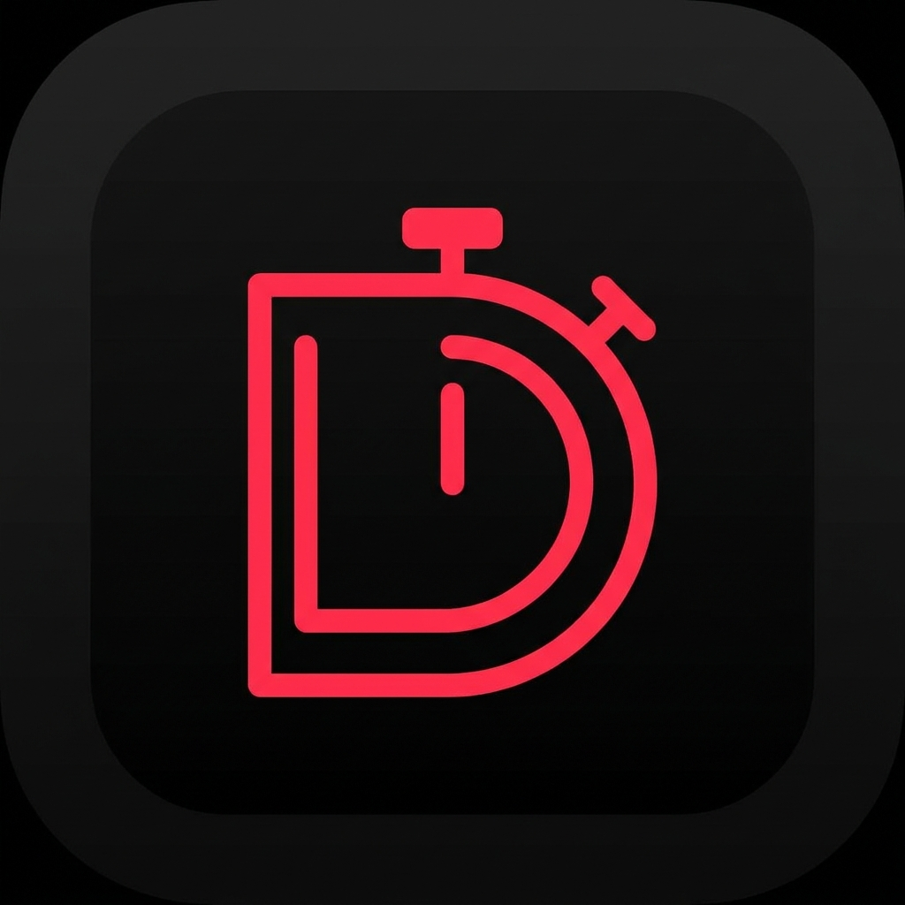

<p align="center">
  
</p>

# DeadlineMe

**No excuses. No extensions. No mercy.**

DeadlineMe is an AI-powered accountability app that charges you real money when you miss your deadlines. Set a goal, stake cash on it, and if you fail — your money goes to a charity you care about.

## How It Works

1. **Set a goal** with a specific deadline
2. **Stake real money** ($1–$500) on it
3. **AI checks in** with reminders before your deadline
4. **Upload proof** (screenshot, photo, link) when you're done
5. **AI verifies** your completion
6. ✅ **Hit it?** Get your money back in full
7. 🤲 **Miss it?** Your loss becomes someone's gain — money goes to charity

---

## Tech Stack

### Mobile (React Native + Expo)
- **Framework:** React Native with Expo SDK 54
- **Navigation:** React Navigation v6 (stack + bottom tabs)
- **State:** React Context + hooks
- **Notifications:** expo-notifications (local)
- **Payments:** Stripe React Native SDK

### Backend (Python + FastAPI)
- **Framework:** FastAPI
- **Database:** Supabase (PostgreSQL)
- **Auth:** Supabase Auth (email, no confirmation required)
- **Payments:** Stripe (test keys, manual capture flow)
- **AI Verification:** OpenAI Vision API (gpt-4o-mini)
- **Task Queue:** asyncio background task (deadline checker every 60s)
- **Hosting:** Railway (auto-deploys from main)

---

## Project Structure

```
deadlineme/
├── mobile/
│   ├── index.js
│   ├── App.js
│   ├── app.json
│   ├── package.json
│   └── src/
│       ├── screens/
│       │   ├── SplashScreen.js
│       │   ├── SignInScreen.js
│       │   ├── SignUpScreen.js
│       │   ├── DashboardScreen.js
│       │   ├── StatsScreen.js
│       │   ├── ProfileScreen.js
│       │   ├── NewStakeScreen.js
│       │   ├── StakeDetailScreen.js
│       │   ├── ProofScreen.js
│       │   ├── GroupsScreen.js
│       │   ├── GroupDetailScreen.js
│       │   └── CreateGroupScreen.js
│       ├── navigation/
│       │   └── RootNavigator.js
│       ├── hooks/
│       │   └── useAuth.js
│       ├── services/
│       │   ├── api.js
│       │   ├── supabase.js
│       │   └── notifications.js
│       └── utils/
│           └── theme.js
├── backend/
│   ├── app/
│   │   ├── main.py
│   │   ├── api/
│   │   │   ├── stakes.py
│   │   │   ├── payments.py
│   │   │   ├── users.py
│   │   │   └── groups.py
│   │   ├── core/
│   │   │   ├── config.py
│   │   │   └── deps.py
│   │   ├── schemas/
│   │   │   └── schemas.py
│   │   └── services/
│   │       ├── stripe_service.py
│   │       ├── ai_verification.py
│   │       └── deadline_checker.py
│   ├── requirements.txt
│   └── Dockerfile
└── README.md
```

---

## Current Status

### ✅ Working End-to-End
- Email auth (Supabase, no email confirmation required)
- Create stake → Stripe payment sheet → DB insert → dashboard refresh
- Cancel stake (60-min grace = free refund, after = 50% forfeit to charity)
- Deadline checker runs every 60s as asyncio background task
- Expired stakes auto-fail, payment captured, moved to history
- Proof upload → real OpenAI Vision verification → refund or reject
- Local notifications (3 reminders: 24h / 1h / at deadline)
- Streaks (completed = +1, failed/exit after grace = break)
- Bottom tabs: Stakes | History | Groups | Profile
- Stats screen: survival rate, HIT/MISS breakdown by category, recent history
- Profile screen: lifetime stats, financial audit, sign out
- **Group Accountability** — create squads, join by invite code, live activity feed (stake created/completed/failed events), squad integrity score, member leaderboard
- Backend deployed on Railway, mobile points at Railway URL
- App icon: D-as-stopwatch neon red logo

### ⏳ Not Yet Built
- Stripe live mode (currently on test keys — requires Stripe identity verification)
- Charity payout pipeline (biggest unresolved item — legal + Stripe Connect setup)
- Apple Developer account ($99) + EAS Build + TestFlight
- Remote push notifications (requires EAS Build)
- Group challenges (everyone stakes on the same goal)
- Production monitoring (Sentry)
- Landing page / waitlist

---

## Getting Started

### Prerequisites
- Node.js 18+
- Python 3.11+
- Supabase account
- Stripe account (test keys)
- OpenAI API key

### Mobile
```bash
cd mobile
npm install
npx expo start --tunnel
```

### Backend (local dev)
```bash
cd backend
python -m venv venv
source venv/bin/activate  # Windows: venv\Scripts\activate
pip install -r requirements.txt
cp .env.example .env
uvicorn app.main:app --host 0.0.0.0 --port 8000 --reload
```

---

## Environment Variables

**Backend (`backend/.env`):**
```
SUPABASE_URL=
SUPABASE_SERVICE_ROLE_KEY=
STRIPE_SECRET_KEY=
STRIPE_WEBHOOK_SECRET=
OPENAI_API_KEY=
DATABASE_URL=
APP_SECRET_KEY=
APP_ENV=development
```

**Mobile (`mobile/.env`):**
```
EXPO_PUBLIC_SUPABASE_URL=
EXPO_PUBLIC_SUPABASE_ANON_KEY=
EXPO_PUBLIC_API_URL=https://deadlineme-production.up.railway.app
```

---

## Database Schema

| Table | Purpose |
|-------|---------|
| `profiles` | Extends Supabase auth, holds streak + lifetime stats |
| `stakes` | Core table — goal, amount, deadline, status, Stripe intent ID |
| `groups` | Accountability squads with auto-generated invite codes |
| `group_members` | Join table with admin/member roles |
| `group_events` | Activity feed — stake_created, stake_completed, stake_failed, member_joined |

All tables have Row Level Security (RLS) enabled.

---

## Charity System

On failure, stakes go to verified charities across 7 categories:

| Category | Charities |
|----------|-----------|
| 🌍 Humanitarian Aid | Doctors Without Borders, Red Cross, UNICEF, Islamic Relief USA |
| 🤲 Poverty Relief | GiveDirectly, Zakat Foundation, Penny Appeal |
| 📖 Education | Room to Read, Khan Academy, DonorsChoose |
| 🏥 Health & Medical | St. Jude, ACS, NAMI |
| 🌱 Environment | WWF, Nature Conservancy |
| 🐾 Animals | ASPCA, Best Friends |
| ✨ Surprise Me | Random selection |

---

## Monetization

- **Free tier:** 1 active stake at a time
- **Pro ($7.99/mo):** Unlimited stakes, AI check-ins, streak tracking, analytics
- **Transaction fee:** 5% on all captured stakes (failures)

---

## API Endpoints

| Method | Endpoint | Description |
|--------|----------|-------------|
| `POST` | `/api/stakes` | Create stake + authorize payment |
| `GET` | `/api/stakes` | Get user's stakes |
| `POST` | `/api/stakes/{id}/proof` | Submit proof for AI verification |
| `POST` | `/api/payments/create-payment-sheet` | Stripe payment sheet |
| `GET` | `/api/users/me` | Get profile |
| `GET` | `/api/users/me/stats` | Get accountability stats |
| `POST` | `/api/groups` | Create group |
| `POST` | `/api/groups/join` | Join group by invite code |
| `GET` | `/api/groups` | Get my groups |
| `GET` | `/api/groups/{id}` | Group detail + members |
| `GET` | `/api/groups/{id}/feed` | Group activity feed |
| `DELETE` | `/api/groups/{id}/leave` | Leave group |

---

## Deployment

- **Backend:** Railway — auto-deploys from `main` branch, root directory `/backend`
- **Mobile:** Expo Go for beta, EAS Build for App Store (not yet set up)

---

## Roadmap

### Done
- [x] Auth (email, no confirmation)
- [x] Create / view / cancel stakes
- [x] Stripe payment sheet (test mode)
- [x] Deadline checker (background task)
- [x] Real OpenAI Vision verification
- [x] Local push notifications
- [x] Streak tracking
- [x] Stats screen + bottom tabs
- [x] Railway deployment
- [x] Full UI redesign (dark, intense, live countdown)
- [x] App icon
- [x] Group accountability (squads, invite codes, activity feed)

### Next
- [ ] Stripe live mode
- [ ] Charity payout pipeline (Stripe Connect)
- [ ] Group challenges (shared goal, everyone stakes)
- [ ] Apple Developer account + EAS Build + TestFlight
- [ ] Landing page + waitlist
- [ ] App Store listing

---

## Author

Bilal Athar — [github.com/batharr41](https://github.com/batharr41)
